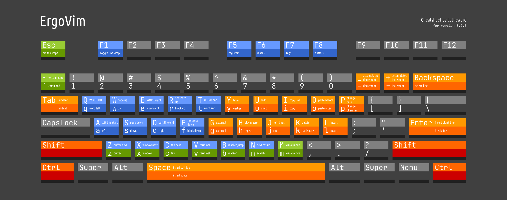

# ErgoVim

ErgoVim is a ergonomic and efficient keymapping for Vim.

## How to Install

You can get it by:
- Download from [release](https://github.com/Letheward/ErgoVim/releases) 
- Clone this repository 
- Just copy the content in the `vimrc` file

Read the `vimrc` file before installing.

If you already have a setup, ignore everything under `Personal Customizations` in the `vimrc`, and copy the rest to your vim config. ErgoVim remaps almost every key, so it will probably break a lot of things, and you need to solve that yourself.

If you are new to Vim and don't have any setup, just throw the `vimrc` file to your vim config directory. You can find it by:

- Vim:

    Open Vim and type `:version`, hit `Enter`. It will output something like this:  
    ~~~
    :version
    VIM - Vi IMproved ...
    ...

    system vimrc file: "/etc/vimrc"
        user vimrc file: "$HOME/.vimrc"
    2nd user vimrc file: "~/.vim/vimrc"
        user exrc file: "$HOME/.exrc"
        defaults file: "$VIMRUNTIME/defaults.vim"
    ...
    ~~~
    (you may need to hit `Enter` to scroll down to see all of it)

    Choose the location of `user vimrc file` or `2nd user vimrc file` to install. (you may need to create a folder and/or rename `vimrc`, base on where you want)

    If you are using MinGW64, you can directly replace `system vimrc file`. It's in your MinGW64 distro's `/etc/`. 

- Neovim:

    Open Neovim, type `:echo stdpath('config')` and Enter. It will output something like this: 

    `C:\Users\You\AppData\Local\nvim` (this is on windows)
    
    Rename ErgoVim's `vimrc` to `init.vim` and put it there (you may need to create the directory first).
    
## How to Use

> ErgoVim assume you use standard US style keyboard. If you use UK style or DVORAK keyboard, or something like HHKB, it may not work as intented.  

(Cheatsheet for ErgoVim, right-click to download if text is too small on your device. This is also included in [release](https://github.com/Letheward/ErgoVim/releases))

### Basic Walkthrough

- Part I
1. Open Vim. Naturally rest your left hand on `wasd`, right hand on `ijkl`.
1. Hit `ll` to enter **Insert Mode**.
1. Enter some gibberish, need to have spaces and blanklines, and long enough that you need to scroll the screen.
1. Hit `Esc` to back to **Normal Mode**.
1. `w`, `a`, `s`, `d` to move cursor.
1. `q`, `e`, `r`, `f` to move by word and paragraph.
1. `W`, `S` (capital means with `Shift`) to scroll pages.
1. `A`, `D` to go to soft line beginning and end (soft means it will ignore spaces at start or end of line).
1. `Ctrl-a` and `Ctrl-d` to go to hard line beginning and end.
1. `Ctrl-w` and `Ctrl-s` to go to file beginning and end.

- Part II
1. `k` to backspace, `K` to delete.
1. `u` to undo, `U` to redo.
1. `m` to enter **Visual Mode** (this is just selecting) and back. Using `Esc` also goes back to **Normal Mode**.
1. Using all the movement keys in Part I to change selection range in **Visual Mode**.
1. In **Visual Mode**, `j` to cut selection, `i` to copy selection.
1. In **Normal Mode**, `jj` to cut a line, `ii` to copy a line. 
1. In **Normal Mode**, `o` to paste after cursor or line, `O` to paste before cursor or line. 
1. In **Visual Mode**, `Ctrl-x`, `Ctrl-c` to cut, copy to system clipboard. 
1. In **Normal Mode**, `Ctrl-v` to paste from system clipboard.

- Part III
1. Hit \` Key to enter Command Line Mode.
1. Type `help cmdline` and hit `Enter`.
1. `xid` to open a copy of that window to the right.
1. `xx` to change window.
1. `xs` to go to window below.
1. `xk` to close current window.
1. `xl` to make current window fullscreen.

### Semantics

Direction Keys:

- `ld` is insert to the *right* of this line.
- `jf` is cut *down the block*.
- `ie` is copy until the *word right*.

Action Keys:

- (same as leader, like `jj`, `ii`, `xx`) do the basic stuff
- `l` enter, confirm, do things
- `k` cancel, delete, exit, close
- `j` change, cut, join
- `i` copy, identity
- `n` new

Examples:

- `xna`: open a *window* to edit *new file*, to the *left*.  
- `ZL`: *entering* the fold.  
- `nk`: *cancel* search highlight.   
- `ni`: *search* using the word under *current* cursor location. 

## Known Issues

- `CapsLock` will change key commands to uppercase key commands.
- Some commands will behave like the old way if it's hold rather than tapped.
- Search back `n` will perform once more if hold, wait for it or hit `N` to cancel.
- Default small version Vim miss many features, like text object, auto-complete, etc. Using key sequences for those features may cause unwanted behaviors.
- `Shift-Enter` on GNOME Terminal/Fedora 33 is not working.
- Terminal window switching is not ideal.
- On Neovim, Visual mode cursor `a` and `d` may lag and need extra key inputs to function.
- Terminal window on Neovim is not working as expected.

## License

The `vimrc` file is dedicated to public domain, or under [CC0](http://creativecommons.org/publicdomain/zero/1.0/).  
Cheatsheet and documentations are licensed under [CC BY-SA 4.0](http://creativecommons.org/licenses/by-sa/4.0/).
